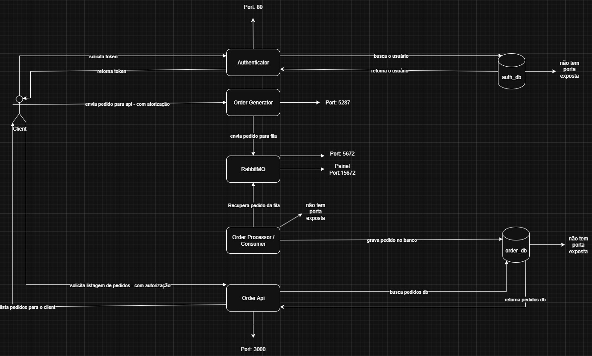

# Ambiente base #

**OSB:** Na raiz do projeto contém uma collection do postman

## Instalação ##

- Primeiro é necessário clonar este repositório: **Obs** _recomento clonar dentro de uma pasta `projeto` por exmeplo_
    
    - Após clonar o ambiente base, execute os seguintes comandos para iniciar o ambiente: **Obs** __estes comandos consideram que você esteja na pasta onde clonou o projeto_
    ```sh
    cd ./BasicEnvironment

    chmod +x ./scripts/ # Permição de execução para os scripts

    ./scripts/start-environment.sh # Clona os as aplicações e inicia a configuração do ambiente
    ```
    Com isso será iniciado a configuração do ambiente.
    Na configuração do autenticador irá solicitar para rodar as migrates do passport com a seguinte mensagem
    ```
        INFO  Publishing [passport-migrations] assets.  

        Copying directory [vendor/laravel/passport/database/migrations] to [database/migrations] .................................................... DONE

        Would you like to run all pending database migrations? (yes/no) [yes]
    ```
    - digite `no`
    - _as migrations serão executadas em seguida pelo script_

- O o autenticador irá criar as chaves, privada e pública, você não terá estas chaves de início no projeto
    
    - Para copiar a chave pública para os demais projetos que irão fazer o decode do token de autorização, basta executar o seguinte comando
    ```sh
    ./scripts/copy-key.sh
    ```
    - **Obs:** _esta prática só está sendo utilizada por ser um ambiente de desenvolvimento_
    - Após isso as chaves foram copiadas para os repositórios das aplicaões e também na pasta `Keys` na pasta atual `BasicEnvironment`

- Agora basta remover o comentário dos commands no `docker-compose.yml`
    - Eles vem por padrão comentados para que o scripts consigam executar as configurações
    - Agora bastar executar:
    ```sh
    docker compose down
    docker compose up #-d para rodar em segundo plano
    ```

**OBS:** Os serviçoes no momento utilizam os server fornecidos pelas libs, em breve adicionarei serviçoes utilizando `ngnx` ou `semelhante


# Fluxo dos serviços #


